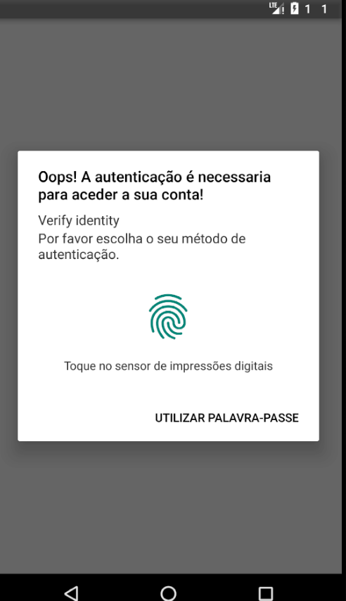
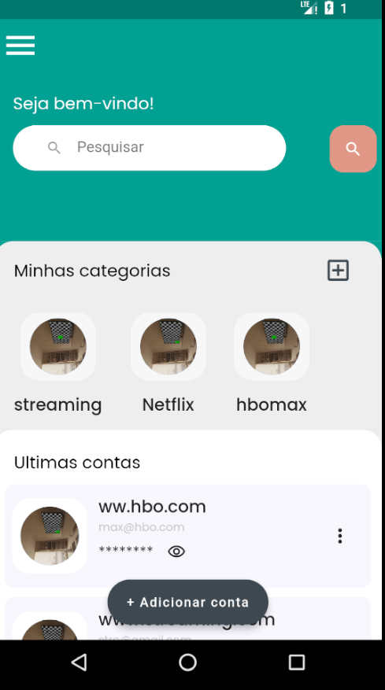
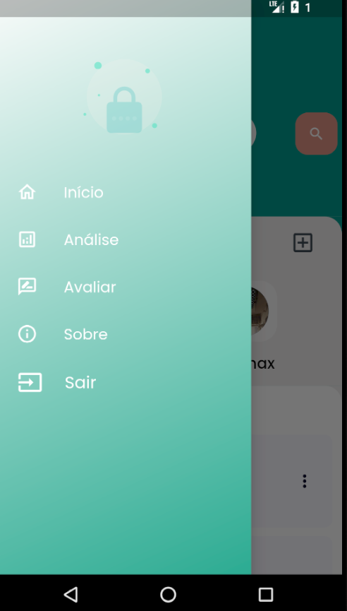
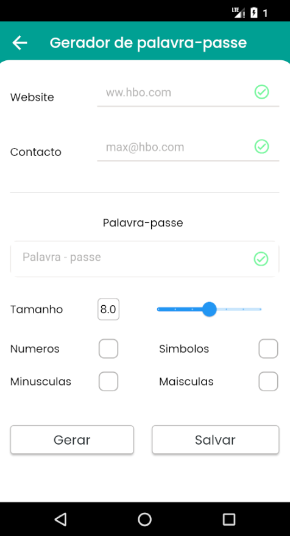

# password_manager

App flutter para gerenciamento de senhas.

## Getting Started

Esse projeto é um ponto de partida para quem está estudando Flutter.
As funcionalidades do app são : 
  # Autenticação usando o seu pin de desbloqueio do telefone ou biometria.
  # Criação, atualização e exclusão de categorias 
  # Criação, atualização e exclusão de contas
  # Analise de senhas 
  # Gerador de senhas

Clone o projeto e estude o código, fique a vontade para editar ou modificar o layout como quiser, só não esqueça de dar aquela estrelinha no repositório (projeto) e até o próximo projeto.

Como clonar este repositório (projeto) :
  -git clone https://github.com/EduardoPembeleAfonso/password-manager

- [Lab: Write your first Flutter app](https://docs.flutter.dev/get-started/codelab)
- [Cookbook: Useful Flutter samples](https://docs.flutter.dev/cookbook)

For help getting started with Flutter development, view the
[online documentation](https://docs.flutter.dev/), which offers tutorials,
samples, guidance on mobile development, and a full API reference.

## Imagens do projecto: 

<!--  -->

